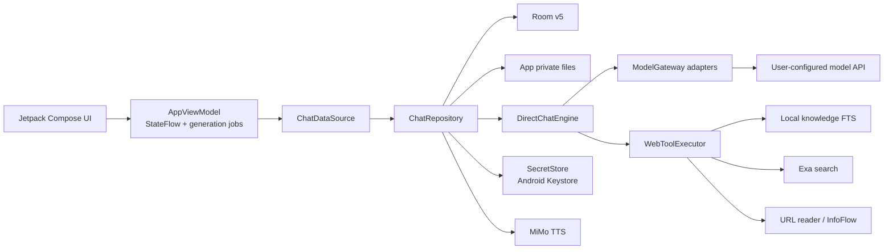

# Android 架构说明

## 系统边界

一念通流 Android App 是单模块原生客户端，采用 BYOK 直连模式。用户在 App 中配置供应商、API Base URL 和 API Key，模型请求直接发往对应端点；Android App 不依赖仓库中的 Go 网关、网页端或旧 `/mobile/v1` 接口。

## 工程形态

- 根工程名为 `TokenFlowChat`，只有 `:app` 一个 Gradle 模块。
- UI 使用 Jetpack Compose 和 Material 3。
- [`TokenFlowApplication`](../app/src/main/java/xyz/mek030399/tokenflow/TokenFlowApplication.kt) 创建 [`AppContainer`](../app/src/main/java/xyz/mek030399/tokenflow/data/AppContainer.kt)，后者组装数据库、文件存储、网络客户端和 Repository。
- [`MainActivity`](../app/src/main/java/xyz/mek030399/tokenflow/MainActivity.kt) 创建 [`AppViewModel`](../app/src/main/java/xyz/mek030399/tokenflow/ui/AppViewModel.kt) 并挂载 Compose。
- 依赖注入为显式构造和 `AppContainer` 手工装配，不使用 Hilt/Dagger。

## 分层职责

| 层 | 主要组件 | 职责 |
| --- | --- | --- |
| UI | `ChatApp.kt`、`WorkspaceScreens.kt`、`MarkdownRenderer.kt` | 页面、导航、输入、Markdown、弹窗、响应式布局和交互状态 |
| 状态 | `AppViewModel.kt` | `StateFlow<AppUiState>`、每会话生成任务、导航和工作区操作 |
| 业务编排 | `ChatRepository.kt` / `ChatDataSource` | 会话事务、上下文、消息落盘、知识预取、模型调用、自动标题、视觉与 TTS |
| 生成引擎 | `DirectChatEngine.kt` | 流式事件、有限传输重试、思考参数降级、工具循环和 usage 汇总 |
| 协议边界 | `ApiClient.kt`、`SseParser.kt` | OpenAI Chat、OpenAI Responses、Anthropic 请求/响应和 SSE 归一化 |
| 本地数据 | `LocalDatabase.kt` | Room 实体、DAO、事务、外键和显式迁移 |
| 文件与知识 | `AttachmentStore.kt`、`KnowledgeStore.kt`、`LocalAvatarStore.kt` | 私有文件生命周期、文档提取、分块、FTS、图片处理和头像 |
| 安全与归档 | `SecretStore.kt`、`ConfigArchive.kt` | 凭据加密、加密配置导入导出 |
| 可选工具 | `WebTools.kt`、`MimoTtsClient.kt` | Exa、URL 读取、InfoFlow、本地知识工具和语音生成 |

## 消息生成数据流

1. UI 将正文、附件、会话配置和手动知识片段交给 `AppViewModel`。
2. ViewModel 为当前会话启动独立 coroutine job；不同会话的生成任务互不复用。
3. Repository 在写入新用户消息前解析附件，并在知识库模式开启时执行本地检索。
4. 用户消息及其 metadata 先写入 Room；metadata 固定本轮知识片段 ID 和视觉描述，保证重试、历史重载和分支一致。
5. Repository 根据最近一次“清空上下文”边界构造历史，注入系统提示词、本地知识和附件内容。
6. `DirectChatEngine` 调用选定协议的 `ModelGateway`，把不同供应商事件统一为文本、思考、工具、usage 和完成/错误事件。
7. 工具调用由 `WebToolExecutor` 执行，结果回送给模型；过程事件持续合并到当前 Assistant metadata。
8. 流式正文和状态实时更新 UI；完成、失败或中断时都持久化最终正文、过程、Token usage 和知识引用。

生成中的消息在进程恢复时会被标记为中断，而不是伪装成成功完成。

## 上下文与知识检索

- “清空上下文”写入逻辑边界，不删除已有消息；边界之前的消息不会进入后续模型请求。
- 开启知识库后，App 先用本次非空用户正文执行本地 FTS 检索，默认最多补足 5 个片段。
- 手动片段优先并保持顺序；自动结果按 chunk ID 去重。手动选择已经达到或超过 5 个时不再自动补充。
- 最终 chunk ID 写入用户消息 metadata，并以不可信的 `<local_knowledge>` 上下文注入，正文总上限为 20,000 字符。
- 模型主动调用 `search_knowledge` 时仍走本地工具路径。自动检索、手动加载和工具检索都会产生过程事件。
- 可引用片段携带 `KnowledgeCitation`。模型只能复制已提供的 `[[KB:<chunkId>]]` 标记，Markdown 层只把 Assistant metadata 允许的标记渲染为 App 内链接。
- 删除文档后，历史 citation 或 chunk ID 会被安全忽略；App 不把未知 ID 当作有效来源。

## 协议归一化

三个协议在 Adapter 边界分别编码，但上层使用统一模型：

- canonical user/assistant/tool 消息
- 文本、思考和工具调用流事件
- 输入、输出、缓存读取/写入 Token usage
- 工具定义、工具执行结果和最终停止原因

这样 Repository、过程 UI 和持久化不需要按供应商分叉。协议特有字段的新增应先在 `Models.kt` 中定义兼容默认值，再分别补齐请求、SSE 和非流式解析测试。

## 持久化边界

- 结构化数据存放于 Room v5。
- Assistant/User 扩展信息存放在消息行内 JSON metadata；可选字段使用默认值兼容旧记录，通常不需要修改 Room 表。
- 附件、知识原文件和头像放在 App 私有文件目录；Room 只保存索引和路径。
- API Key 不存入 Room，由 `SecretStore` 使用 Android Keystore 加密后写入私有 SharedPreferences。
- TTS 音频是可重建缓存，不进入 Room。

更详细的数据位置和删除语义见 [数据与安全](DATA_AND_SECURITY.md)。

## 响应式 UI

布局直接基于 Compose `BoxWithConstraints` 的可用宽度，不使用 Android WindowSizeClass：

| 宽度 | 布局 |
| --- | --- |
| `< 600dp` | 手机布局，导航使用抽屉 |
| `>= 600dp` | 常驻导航侧栏 |
| `>= 1000dp` | Chat 可显示第三栏 inspector |

Chat 的会话列表与“功能与设置”入口互斥占用侧栏剩余高度并分别保留滚动位置；其他工作区的导航入口也位于独立滚动区域，保证横屏短高度和大字体下最后一项仍可访问。

新增固定格式控件时应给出稳定尺寸或约束，避免流式内容、Token 行或动态按钮造成布局抖动。

## 关键设计约束

- 保持 App 对 Go 后端无运行时依赖。
- 数据库升级必须增加显式 migration，并提交新的 Room schema 快照；禁止 destructive fallback。
- 不在请求日志或诊断信息中记录 API Key、完整请求正文或签名凭据。
- Provider Base URL 与 URL Reader 的安全策略不同，不要共用一套宽松校验。
- 过程、usage、citation 和消息正文必须在完成、错误与取消路径上保持一致落盘。
- 删除会话依赖 Room 外键级联删除消息、附件和收藏；UI 还应立即过滤陈旧状态。
